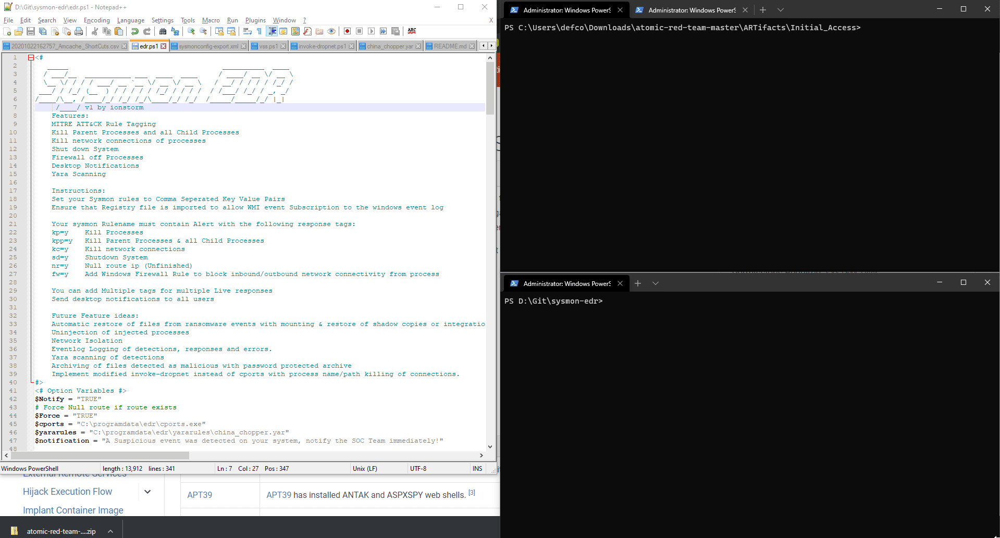

## sysmon-edr

# Sysmon EDR Active Response Features
* Mitre ATT&CK Desktop Alerts
* Yara Scanning
* Ransomware/File Delete Auto-Restore of Files to original directories.
* Malicious Process Killing
* Injected Threat Killer
* Killing of Malicious process connections
* Blocking of Process network connectivity with Windows Firewall
* Response with Yara Detections

# Instructions 
Install Sysmon, and format your rules to include Alert= within your sysmon config Rulename field with the comma seperated key value Active response modifiers specified at the beginning of the Sysmon config file. 
Download & Extract the sysmon-edr repository to a folder of your choosing and then run .\install_edr.ps1 then start the sysmon_edr service.
To stop sysmon EDR, kill the powershell process running as system, until proper service control manager functionality is introduced.
 
The reg file has to be imported in order to read sysmon eventlog events with wmi.

Multiple Active Response actions can be used per alert, ie Kill Process, Delete File, Kill connections & Firewall off processes.

Developers wanted, this project should be community developed.

# Planned Future features:
* Host isolation with null routes
* Host Isolation with system shut down
* Host isolation with exceptions for support sites/AV/EDR rule to allow outlook/common apps only.
* Automated process memory dumping for forensics
* Automated threat removal based on signatures and behavior: Process Kill then Quarantine or Delete file, Service stop and quarantine or delete file, Kill process and remove registry persistence, startup folder file removal.
* Automated upload of malicious files and memory dumps
* Automated Registry/Scheduled Task/Service and Persistence removal
* Detection of Injected processes and uninject them
* VSS Snapshot restoration of files by mounting restore point, copying uninfected files to original location: Could utilize Sysmon's new restore abilities
* Undo changes made by malware(if it gets that far)
* Collect incident response data when suspicious activity is detected, upload to repository.
	* Autoruns, Installed Programs, Network Connections, Prefetch files, running processes, security logs, suspicious folder location items, newly created users and groups and more.
* Quarantine malicious files instead of delete by moving to a Quarantine directory.
